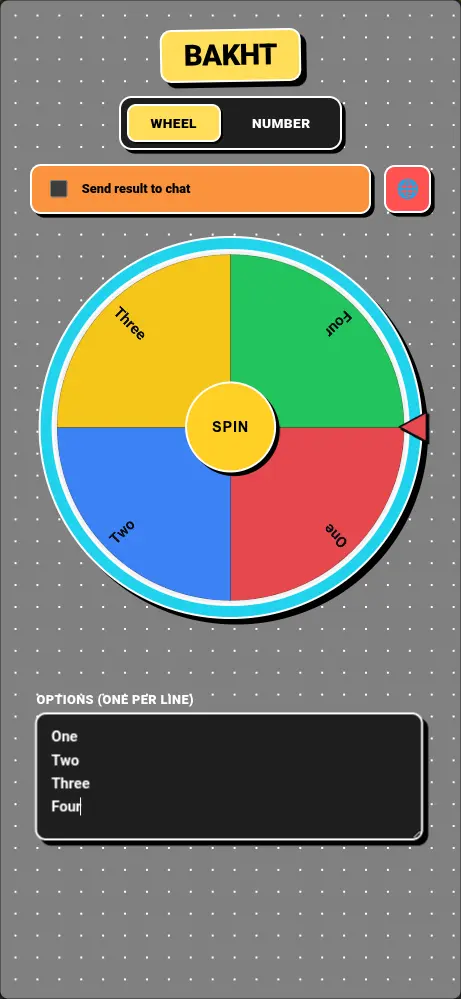

# Bakht

**Bakht** (means "luck" in Persian) is a [webxdc](https://webxdc.org) app that runs inside **Delta Chat**, providing two methods for making random decisions:

- 🎡 **Wheel** — enter your options (one per line, up to 50) and spin the wheel to pick a winner.
- 🔢 **Number** — pick a random number within any range (up to 1,000,000,000).

## Screenshot

## Features

- **Spin wheel** - With animated acceleration and deceleration physics
- **Random number picker** - With a rolling "slot machine" animation
- **Optional share results to the chat** - The options and winning result is posted as a webxdc update, so other chat members can open it and *try the same options themselves*
- **Multi-language support** - All UI text is managed through i18n files

## Development

The app is plain HTML/CSS/JS with no build step. Open `index.html` directly in a browser to develop — `webxdc.js` provides a stub of the webxdc API so everything works outside Delta Chat (results are logged to the console instead of posted to a chat).

To test real chat integration, package the folder as a `.zip` file, rename it to `.xdc` and share it in a DeltaChat chat.

### Adding a language

Add a new dictionary entry in `i18n.js` (copy the `en` block and translate the strings).
